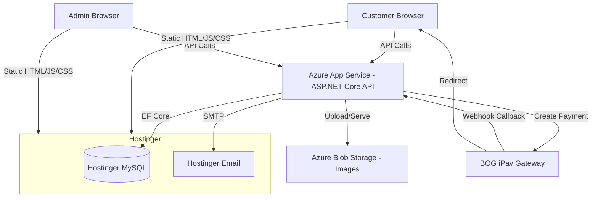
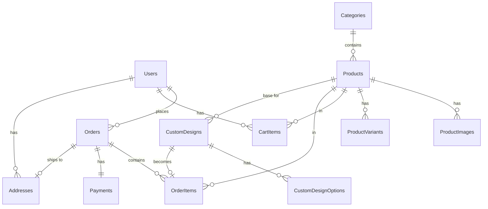
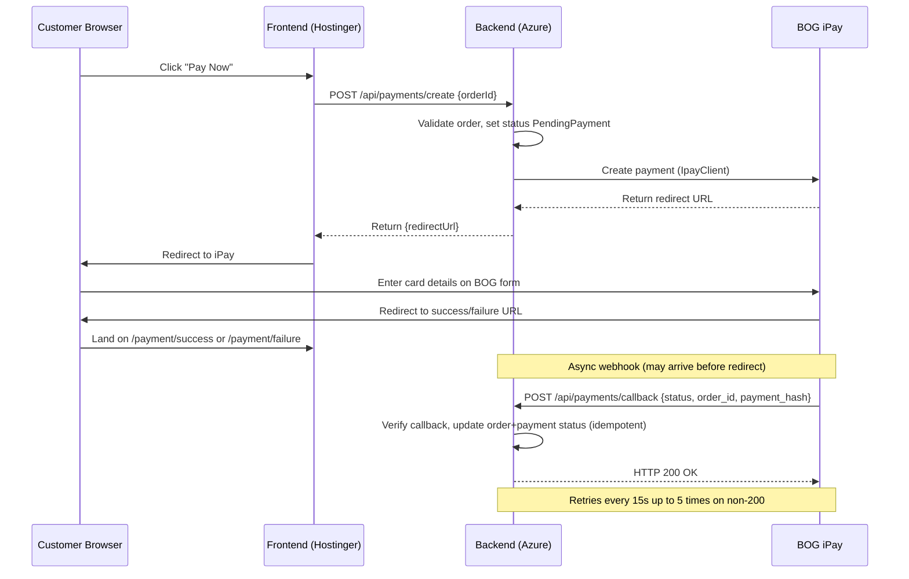

# Dressfield — Architecture Blueprint

## 1. Executive Recommendation

Build Dressfield as a **modular monolith** with a clear frontend/backend split:
- **Next.js static export** for SEO-friendly product pages deployed to Hostinger
- **ASP.NET Core Web API** on Azure App Service for business logic
- **MySQL** on Hostinger for data persistence
- **Bank of Georgia iPay** for payments (redirect-based)

This architecture is right-sized for a small embroidery business (<50 products, solo developer). It avoids microservices overhead while maintaining clean separation of concerns.

---

## 2. High-Level System Architecture



**Request flow:**
1. Browser loads static HTML/JS from Hostinger
2. Client-side JavaScript calls ASP.NET Core API on Azure
3. API reads/writes MySQL on Hostinger
4. Images served from Azure Blob Storage
5. Payments redirect to BOG iPay, then back to frontend

---

## 3. SEO Architecture

### Static Export Strategy

Since Hostinger doesn't support Node.js SSR, we use `next export` for fully static output:

| Page Type | Rendering | SEO Impact |
|-----------|-----------|------------|
| Homepage | SSG at build time | Full HTML for crawlers ✓ |
| Product listing | SSG at build time | Full HTML with product data ✓ |
| Product detail | SSG at build time | Full HTML, structured data ✓ |
| Category pages | SSG at build time | Full HTML with meta tags ✓ |
| Cart/Checkout | Client-side only | No SEO needed (private pages) |
| Admin pages | Client-side only | No SEO needed (private pages) |

**Trade-off:** Product changes require rebuild + redeploy. For <50 products this takes seconds.

### SEO Checklist
- `next-sitemap` generates XML sitemap at build time
- Per-page metadata via Next.js `generateMetadata`
- JSON-LD structured data: `Product`, `BreadcrumbList`, `Organization`
- Open Graph + Twitter Card meta tags
- Canonical URLs on all pages
- Georgian-language `<html lang="ka">` tag
- Alt text on all product images

---

## 4. Analytics Architecture

### Meta Pixel Integration

```
lib/analytics.ts — Abstraction layer
├── initPixel() — Called once in root layout
├── trackPageView() — Fires on route change
├── trackViewContent(product) — Product detail page
├── trackAddToCart(item) — Add to cart action
├── trackInitiateCheckout(cart) — Start checkout
└── trackPurchase(order) — Order confirmation
```

**Implementation:**
- Use Next.js `<Script strategy="afterInteractive">` for pixel initialization
- Abstraction layer in `lib/analytics.ts` allows adding GA4 later without changing components
- Event parameters follow Meta Pixel spec (content_ids, content_type, value, currency)
- Currency: GEL (Georgian Lari)

---

## 5. Backend Architecture

### Layer Structure (Clean Architecture)

```
Dressfield.API/                    # Presentation layer
├── Controllers/
│   ├── AuthController.cs          # Login, register, refresh token
│   ├── ProductsController.cs      # Product CRUD + public listing
│   ├── CategoriesController.cs    # Category CRUD
│   ├── CartController.cs          # Cart sync for authenticated users
│   ├── OrdersController.cs        # Order creation + management
│   ├── PaymentsController.cs      # iPay redirect + webhook callback
│   ├── CustomDesignsController.cs # Design upload + admin review
│   └── ImagesController.cs        # Image upload to Blob Storage
├── Middleware/
│   ├── ExceptionMiddleware.cs     # Global error handling
│   └── RequestLoggingMiddleware.cs
├── Filters/
│   └── ValidationFilter.cs        # FluentValidation auto-validation
└── Program.cs                     # DI configuration, pipeline setup

Dressfield.Core/                   # Domain layer (no dependencies)
├── Entities/
│   ├── User.cs
│   ├── Product.cs
│   ├── ProductImage.cs
│   ├── ProductVariant.cs
│   ├── Category.cs
│   ├── CartItem.cs
│   ├── Order.cs
│   ├── OrderItem.cs
│   ├── Payment.cs
│   ├── CustomDesign.cs
│   ├── CustomDesignOption.cs
│   └── Address.cs
├── Enums/
│   ├── OrderStatus.cs             # PendingPayment, Processing, Shipped, Delivered, Cancelled
│   ├── PaymentStatus.cs           # Pending, Completed, Failed, Refunded
│   └── CustomDesignStatus.cs      # Pending, Approved, Rejected, ChangesRequested
├── Interfaces/
│   ├── IProductRepository.cs
│   ├── IOrderRepository.cs
│   ├── IPaymentService.cs
│   ├── IImageService.cs
│   └── IEmailService.cs
└── DTOs/
    ├── Products/
    ├── Orders/
    ├── Auth/
    └── CustomDesigns/

Dressfield.Application/            # Business logic layer
├── Services/
│   ├── ProductService.cs
│   ├── OrderService.cs
│   ├── CartService.cs
│   ├── CustomDesignService.cs
│   └── PricingService.cs          # Base price + option add-ons
├── Validators/
│   ├── CreateProductValidator.cs
│   ├── CreateOrderValidator.cs
│   └── UploadDesignValidator.cs
└── Mappings/
    └── MappingProfile.cs          # AutoMapper or manual mappings

Dressfield.Infrastructure/         # External services layer
├── Data/
│   ├── AppDbContext.cs
│   ├── Migrations/
│   └── Configurations/            # EF Fluent API entity configs
│       ├── ProductConfiguration.cs
│       ├── OrderConfiguration.cs
│       └── ...
├── Repositories/
│   ├── ProductRepository.cs
│   └── OrderRepository.cs
├── Services/
│   ├── PaymentService.cs          # BOG iPay integration
│   ├── ImageService.cs            # Azure Blob Storage
│   └── EmailService.cs            # SMTP via Hostinger
└── Identity/
    └── JwtService.cs              # JWT token generation/validation
```

### API Conventions
- RESTful routes: `GET /api/products`, `POST /api/orders`, etc.
- Pagination: `?page=1&pageSize=20` with `X-Total-Count` header
- Error response: `{ "error": "message", "details": [...] }`
- Auth: `Authorization: Bearer <jwt>` header
- CORS: Allow frontend origin only

---

## 6. Frontend Architecture

```
Dressfield.web/
├── next.config.js                  # Static export config (output: 'export')
├── tailwind.config.ts
├── tsconfig.json
├── public/
│   ├── fonts/                      # Georgian fonts (BPG fonts)
│   └── images/                     # Static assets (logo, icons)
├── src/
│   ├── app/                        # Next.js App Router
│   │   ├── layout.tsx              # Root layout (Meta Pixel init, fonts, header/footer)
│   │   ├── page.tsx                # Homepage
│   │   ├── products/
│   │   │   ├── page.tsx            # Product listing (SSG)
│   │   │   └── [slug]/
│   │   │       └── page.tsx        # Product detail (SSG)
│   │   ├── categories/
│   │   │   └── [slug]/
│   │   │       └── page.tsx        # Category listing (SSG)
│   │   ├── custom-order/
│   │   │   └── page.tsx            # Custom design order flow
│   │   ├── cart/
│   │   │   └── page.tsx            # Shopping cart
│   │   ├── checkout/
│   │   │   └── page.tsx            # Checkout flow
│   │   ├── orders/
│   │   │   ├── page.tsx            # Order history
│   │   │   └── [id]/
│   │   │       └── page.tsx        # Order detail
│   │   ├── auth/
│   │   │   ├── login/page.tsx
│   │   │   ├── register/page.tsx
│   │   │   └── forgot-password/page.tsx
│   │   ├── admin/
│   │   │   ├── layout.tsx          # Admin layout with sidebar
│   │   │   ├── page.tsx            # Dashboard
│   │   │   ├── products/
│   │   │   │   ├── page.tsx        # Product list
│   │   │   │   ├── new/page.tsx    # Create product
│   │   │   │   └── [id]/edit/page.tsx
│   │   │   ├── categories/page.tsx
│   │   │   ├── orders/
│   │   │   │   ├── page.tsx        # Order list
│   │   │   │   └── [id]/page.tsx   # Order detail
│   │   │   └── custom-orders/
│   │   │       ├── page.tsx        # Custom order list
│   │   │       └── [id]/page.tsx   # Review custom order
│   │   ├── payment/
│   │   │   ├── success/page.tsx    # Payment success redirect
│   │   │   └── failure/page.tsx    # Payment failure redirect
│   │   └── not-found.tsx           # 404 page
│   ├── components/
│   │   ├── ui/                     # shadcn/ui primitives (Button, Input, Card, etc.)
│   │   ├── layout/
│   │   │   ├── Header.tsx
│   │   │   ├── Footer.tsx
│   │   │   ├── Navigation.tsx
│   │   │   └── CartDrawer.tsx
│   │   ├── shop/
│   │   │   ├── ProductCard.tsx
│   │   │   ├── ProductGrid.tsx
│   │   │   ├── ProductGallery.tsx
│   │   │   ├── VariantSelector.tsx
│   │   │   ├── CategoryFilter.tsx
│   │   │   └── PriceDisplay.tsx
│   │   ├── custom/
│   │   │   ├── DesignUploader.tsx   # react-dropzone upload
│   │   │   ├── DesignEditor.tsx     # Crop/rotate/resize (fabric.js)
│   │   │   ├── OptionSelector.tsx   # Size, placement, colors
│   │   │   ├── PricingBreakdown.tsx # Base + add-ons display
│   │   │   └── ProductMockup.tsx    # Canvas preview of design on product
│   │   ├── checkout/
│   │   │   ├── AddressForm.tsx
│   │   │   ├── OrderSummary.tsx
│   │   │   └── PaymentRedirect.tsx
│   │   └── admin/
│   │       ├── AdminSidebar.tsx
│   │       ├── ProductForm.tsx
│   │       ├── OrderTable.tsx
│   │       └── StatsCards.tsx
│   ├── lib/
│   │   ├── api.ts                  # Fetch wrapper with auth headers
│   │   ├── auth.tsx                # AuthContext + useAuth hook
│   │   ├── cart.ts                 # Zustand cart store
│   │   ├── analytics.ts           # Meta Pixel abstraction
│   │   ├── utils.ts               # Format price, slugify, etc.
│   │   └── constants.ts           # API URL, pixel ID, etc.
│   ├── hooks/
│   │   ├── useProducts.ts         # TanStack Query hook
│   │   ├── useOrders.ts
│   │   └── useCategories.ts
│   └── types/
│       ├── product.ts
│       ├── order.ts
│       ├── cart.ts
│       ├── auth.ts
│       └── custom-design.ts
└── package.json
```

---

## 7. Core Business Modules

### Module Boundaries

| Module | Owns | Depends On |
|--------|------|------------|
| Auth | Users, Sessions, Tokens | — |
| Products | Products, Variants, Images, Categories | Auth (admin check) |
| Custom Design | Designs, Options, Mockups | Products (base product), Auth (upload) |
| Cart | CartItems | Products, Custom Design, Auth (optional) |
| Orders | Orders, OrderItems, Addresses | Cart, Auth, Products |
| Payments | Payments, iPay transactions | Orders |
| Admin | Dashboard aggregations | Products, Orders, Custom Design |
| Email | Email templates, SMTP | Orders, Auth |

---

## 8. Database Design

### Entity Relationship Diagram



### Table Definitions (MVP)

```sql
-- Users (via ASP.NET Identity, extended)
CREATE TABLE Users (
    Id VARCHAR(36) PRIMARY KEY,
    Email VARCHAR(255) NOT NULL UNIQUE,
    PasswordHash VARCHAR(255) NOT NULL,
    FirstName VARCHAR(100),
    LastName VARCHAR(100),
    Phone VARCHAR(20),
    Role ENUM('Customer', 'Admin') DEFAULT 'Customer',
    CreatedAt DATETIME DEFAULT CURRENT_TIMESTAMP,
    UpdatedAt DATETIME DEFAULT CURRENT_TIMESTAMP ON UPDATE CURRENT_TIMESTAMP
);

-- Categories
CREATE TABLE Categories (
    Id INT AUTO_INCREMENT PRIMARY KEY,
    Name VARCHAR(200) NOT NULL,
    Slug VARCHAR(200) NOT NULL UNIQUE,
    Description TEXT,
    ImageUrl VARCHAR(500),
    ParentId INT NULL,
    SortOrder INT DEFAULT 0,
    IsActive BOOLEAN DEFAULT TRUE,
    FOREIGN KEY (ParentId) REFERENCES Categories(Id)
);

-- Products
CREATE TABLE Products (
    Id INT AUTO_INCREMENT PRIMARY KEY,
    Name VARCHAR(300) NOT NULL,
    Slug VARCHAR(300) NOT NULL UNIQUE,
    Description TEXT,
    Price DECIMAL(10,2) NOT NULL,
    CompareAtPrice DECIMAL(10,2) NULL,
    CategoryId INT NOT NULL,
    IsActive BOOLEAN DEFAULT TRUE,
    IsCustomizable BOOLEAN DEFAULT FALSE,
    CreatedAt DATETIME DEFAULT CURRENT_TIMESTAMP,
    UpdatedAt DATETIME DEFAULT CURRENT_TIMESTAMP ON UPDATE CURRENT_TIMESTAMP,
    FOREIGN KEY (CategoryId) REFERENCES Categories(Id)
);

-- Product Images
CREATE TABLE ProductImages (
    Id INT AUTO_INCREMENT PRIMARY KEY,
    ProductId INT NOT NULL,
    Url VARCHAR(500) NOT NULL,
    AltText VARCHAR(300),
    SortOrder INT DEFAULT 0,
    IsPrimary BOOLEAN DEFAULT FALSE,
    FOREIGN KEY (ProductId) REFERENCES Products(Id) ON DELETE CASCADE
);

-- Product Variants
CREATE TABLE ProductVariants (
    Id INT AUTO_INCREMENT PRIMARY KEY,
    ProductId INT NOT NULL,
    Name VARCHAR(200) NOT NULL,
    SKU VARCHAR(100) UNIQUE,
    Price DECIMAL(10,2) NOT NULL,
    Stock INT DEFAULT 0,
    IsActive BOOLEAN DEFAULT TRUE,
    FOREIGN KEY (ProductId) REFERENCES Products(Id) ON DELETE CASCADE
);

-- Custom Designs
CREATE TABLE CustomDesigns (
    Id INT AUTO_INCREMENT PRIMARY KEY,
    UserId VARCHAR(36) NULL,
    GuestEmail VARCHAR(255) NULL,
    ProductId INT NOT NULL,
    DesignImageUrl VARCHAR(500) NOT NULL,
    Status ENUM('Pending', 'Approved', 'Rejected', 'ChangesRequested') DEFAULT 'Pending',
    AdminNotes TEXT,
    TotalPrice DECIMAL(10,2) NOT NULL,
    CreatedAt DATETIME DEFAULT CURRENT_TIMESTAMP,
    FOREIGN KEY (UserId) REFERENCES Users(Id),
    FOREIGN KEY (ProductId) REFERENCES Products(Id)
);

-- Custom Design Options (selected by customer)
CREATE TABLE CustomDesignOptions (
    Id INT AUTO_INCREMENT PRIMARY KEY,
    CustomDesignId INT NOT NULL,
    OptionType VARCHAR(50) NOT NULL,  -- 'size', 'placement', 'material', 'thread_color'
    OptionValue VARCHAR(200) NOT NULL,
    PriceAddon DECIMAL(10,2) DEFAULT 0,
    FOREIGN KEY (CustomDesignId) REFERENCES CustomDesigns(Id) ON DELETE CASCADE
);

-- Addresses
CREATE TABLE Addresses (
    Id INT AUTO_INCREMENT PRIMARY KEY,
    UserId VARCHAR(36) NULL,
    FullName VARCHAR(200) NOT NULL,
    AddressLine1 VARCHAR(300) NOT NULL,
    AddressLine2 VARCHAR(300),
    City VARCHAR(100) NOT NULL,
    PostalCode VARCHAR(20),
    Phone VARCHAR(20) NOT NULL,
    IsDefault BOOLEAN DEFAULT FALSE,
    FOREIGN KEY (UserId) REFERENCES Users(Id)
);

-- Orders
CREATE TABLE Orders (
    Id INT AUTO_INCREMENT PRIMARY KEY,
    UserId VARCHAR(36) NULL,
    GuestEmail VARCHAR(255) NULL,
    AddressId INT NOT NULL,
    Status ENUM('PendingPayment', 'Processing', 'Shipped', 'Delivered', 'Cancelled') DEFAULT 'PendingPayment',
    TotalAmount DECIMAL(10,2) NOT NULL,
    Notes TEXT,
    CreatedAt DATETIME DEFAULT CURRENT_TIMESTAMP,
    UpdatedAt DATETIME DEFAULT CURRENT_TIMESTAMP ON UPDATE CURRENT_TIMESTAMP,
    FOREIGN KEY (UserId) REFERENCES Users(Id),
    FOREIGN KEY (AddressId) REFERENCES Addresses(Id)
);

-- Order Items
CREATE TABLE OrderItems (
    Id INT AUTO_INCREMENT PRIMARY KEY,
    OrderId INT NOT NULL,
    ProductId INT NOT NULL,
    VariantId INT NULL,
    CustomDesignId INT NULL,
    Quantity INT NOT NULL DEFAULT 1,
    UnitPrice DECIMAL(10,2) NOT NULL,
    FOREIGN KEY (OrderId) REFERENCES Orders(Id) ON DELETE CASCADE,
    FOREIGN KEY (ProductId) REFERENCES Products(Id),
    FOREIGN KEY (VariantId) REFERENCES ProductVariants(Id),
    FOREIGN KEY (CustomDesignId) REFERENCES CustomDesigns(Id)
);

-- Payments
CREATE TABLE Payments (
    Id INT AUTO_INCREMENT PRIMARY KEY,
    OrderId INT NOT NULL UNIQUE,
    TransactionId VARCHAR(200),
    IPayPaymentId VARCHAR(200),
    Status ENUM('Pending', 'Completed', 'Failed', 'Refunded') DEFAULT 'Pending',
    Amount DECIMAL(10,2) NOT NULL,
    Currency VARCHAR(3) DEFAULT 'GEL',
    PaymentMethod VARCHAR(50),
    CardType VARCHAR(50),
    PaymentHash VARCHAR(500),
    CreatedAt DATETIME DEFAULT CURRENT_TIMESTAMP,
    UpdatedAt DATETIME DEFAULT CURRENT_TIMESTAMP ON UPDATE CURRENT_TIMESTAMP,
    FOREIGN KEY (OrderId) REFERENCES Orders(Id)
);

-- Cart Items (server-side for authenticated users)
CREATE TABLE CartItems (
    Id INT AUTO_INCREMENT PRIMARY KEY,
    UserId VARCHAR(36) NOT NULL,
    ProductId INT NOT NULL,
    VariantId INT NULL,
    CustomDesignId INT NULL,
    Quantity INT NOT NULL DEFAULT 1,
    AddedAt DATETIME DEFAULT CURRENT_TIMESTAMP,
    FOREIGN KEY (UserId) REFERENCES Users(Id) ON DELETE CASCADE,
    FOREIGN KEY (ProductId) REFERENCES Products(Id),
    FOREIGN KEY (VariantId) REFERENCES ProductVariants(Id),
    FOREIGN KEY (CustomDesignId) REFERENCES CustomDesigns(Id)
);
```

---

## 9. Authentication & Authorization

### Flow

```
Register → Email/Password → ASP.NET Identity creates user → JWT issued
Login → Email/Password → Identity validates → JWT access token + refresh token
```

### Token Strategy
- **Access token**: Short-lived (15 min), stored in JavaScript memory (not localStorage)
- **Refresh token**: Long-lived (7 days), stored in httpOnly secure cookie
- **Token refresh**: Silent refresh on 401 response via interceptor in `lib/api.ts`

### Guest Checkout
- No authentication required for browsing or adding to cart
- Guest checkout collects email + shipping address without creating an account
- Guest order linked via `GuestEmail` field (no UserId)
- After purchase, offer account creation with pre-filled email

### Admin Authorization
- Role-based: `[Authorize(Roles = "Admin")]` on admin endpoints
- Frontend: check `user.role === 'Admin'` in auth context, redirect if not admin

---

## 10. Payment Architecture (BOG iPay)

### Sequence



### Idempotency
- Callback endpoint checks if payment status already matches
- If already processed, return 200 without side effects
- Use `IPayPaymentId` as idempotency key
- Wrap status update in database transaction

### Test Mode
- Demo ClientId: `1006`
- Demo SecretKey: `581ba5eeadd657c8ccddc74c839bd3ad`
- Demo BaseUrl: `https://dev.ipay.ge/opay/api/v1`

---

## 11. Deployment & Environment Strategy

### Environments

| Environment | Frontend | Backend | Database |
|-------------|----------|---------|----------|
| Development | localhost:3000 | localhost:5000 | Local MySQL |
| Staging | Hostinger (subdomain) | Azure (staging slot) | Hostinger MySQL (staging DB) |
| Production | Hostinger (main domain) | Azure (production) | Hostinger MySQL (prod DB) |

### Frontend Deployment (Hostinger)
1. `npm run build` → generates `out/` directory
2. Upload `out/` contents to Hostinger via FTP or Git
3. Configure `.htaccess` for SPA fallback routing
4. Set up SSL certificate

### Backend Deployment (Azure)
1. Git push to Azure App Service (or GitHub Actions)
2. Environment variables via Azure Configuration
3. EF Core migrations run on startup
4. Health check endpoint at `/api/health`

### CI/CD (optional, recommended)
```yaml
# GitHub Actions: on push to main
# 1. Build frontend → deploy to Hostinger via FTP
# 2. Build backend → deploy to Azure via azure/webapps-deploy
```

---

## 12. Recommended Folder Structures

See sections 5 (Backend) and 6 (Frontend) above for complete directory structures.

---

## 13. API Design Examples

### Products

```
GET    /api/products                    # List products (paginated, filterable)
GET    /api/products/{slug}             # Get product by slug
POST   /api/admin/products              # Create product (admin)
PUT    /api/admin/products/{id}         # Update product (admin)
DELETE /api/admin/products/{id}         # Delete product (admin)
POST   /api/admin/products/{id}/images  # Upload product image (admin)
```

### Orders

```
POST   /api/orders                      # Create order from cart
GET    /api/orders                      # List user's orders
GET    /api/orders/{id}                 # Get order detail
GET    /api/admin/orders                # List all orders (admin)
PUT    /api/admin/orders/{id}/status    # Update order status (admin)
```

### Payments

```
POST   /api/payments/create             # Create iPay payment, get redirect URL
POST   /api/payments/callback           # iPay webhook callback (public, no auth)
GET    /api/payments/{orderId}/status    # Get payment status
```

### Custom Designs

```
POST   /api/custom-designs              # Submit custom design order
GET    /api/custom-designs/{id}         # Get design details
GET    /api/admin/custom-designs        # List all designs (admin)
PUT    /api/admin/custom-designs/{id}   # Approve/reject design (admin)
```

### Response Format

```json
// Success (single item)
{
  "data": { ... },
  "success": true
}

// Success (list with pagination)
{
  "data": [ ... ],
  "pagination": {
    "page": 1,
    "pageSize": 20,
    "totalCount": 47,
    "totalPages": 3
  },
  "success": true
}

// Error
{
  "error": "Validation failed",
  "details": [
    { "field": "email", "message": "Email is required" }
  ],
  "success": false
}
```

---

## 14. Recommended Libraries

### Backend (NuGet)

| Package | Purpose |
|---------|---------|
| `Pomelo.EntityFrameworkCore.MySql` | MySQL provider for EF Core |
| `Microsoft.AspNetCore.Identity.EntityFrameworkCore` | User authentication |
| `Microsoft.AspNetCore.Authentication.JwtBearer` | JWT auth middleware |
| `Helix.BankOfGeorgia.IpayClient` | BOG iPay integration |
| `FluentValidation.AspNetCore` | Request validation |
| `Serilog.AspNetCore` | Structured logging |
| `Azure.Storage.Blobs` | Image storage |
| `MailKit` | SMTP email sending |
| `Swashbuckle.AspNetCore` | Swagger/OpenAPI docs |

### Frontend (npm)

| Package | Purpose |
|---------|---------|
| `next` | React framework with static export |
| `tailwindcss` | Utility-first CSS |
| `@tanstack/react-query` | Server state management |
| `zustand` | Client state management |
| `react-dropzone` | File upload UI |
| `fabric` | Canvas-based design editor + mockup preview |
| `next-sitemap` | XML sitemap generation |
| `react-hook-form` + `zod` | Form handling + validation |
| `lucide-react` | Icon library |
| `date-fns` | Date formatting |

---

## 15. Non-Functional Requirements

| Category | Requirement |
|----------|-------------|
| Performance | Product pages load in <3s on 3G connection |
| Performance | API response time <500ms for 95th percentile |
| Security | HTTPS enforced on all endpoints |
| Security | CORS restricted to frontend origin |
| Security | Rate limiting on auth endpoints (10 req/min) |
| Security | File upload validation (type, size, dimensions) |
| Reliability | iPay webhook handler is idempotent |
| Reliability | Database transactions for order + payment status updates |
| Accessibility | WCAG 2.1 AA for public-facing pages |
| SEO | Lighthouse SEO score 90+ |

---

## 16. MVP vs Future Scaling

### MVP (Current Milestone)
- Single server (Azure App Service B1)
- Shared MySQL (Hostinger)
- Static frontend (Hostinger)
- Manual rebuild on product changes
- Admin manages via web dashboard

### Future Scaling (When Needed)
- Azure App Service scale-up or scale-out
- Managed MySQL (Azure Database for MySQL) if Hostinger limits hit
- CDN for static assets (Azure CDN or Cloudflare)
- Vercel for frontend if SSR/ISR becomes needed
- Background job processing (Hangfire) for email queues
- Redis for session/cache if performance requires

---

## 17. Step-by-Step Implementation Plan

See `.planning/ROADMAP.md` for the detailed 7-phase implementation plan with requirement mappings and success criteria.

**Summary:**
1. Foundation & Scaffolding (auth, layout, deployment)
2. Product Catalog (CRUD, browsing, SEO)
3. Custom Design Orders (upload, editor, preview, pricing)
4. Cart & Checkout (cart, shipping, order creation)
5. Payments & Order Management (iPay, webhooks, email)
6. Analytics & SEO Polish (Meta Pixel, dashboard, audit)
7. Security, Polish & Launch (hardening, logging, production)

---

## 18. High-Level Phases Detail

See `.planning/ROADMAP.md` for complete phase details including:
- Per-phase requirements mapping
- Success criteria (observable user behaviors)
- Plan breakdowns within each phase
- Dependencies between phases

---

## 19. Final Verdict

Dressfield is a well-scoped project for a small Georgian embroidery business. The architecture is deliberately simple:

- **Static export + API** avoids the complexity of SSR hosting while maintaining SEO through build-time rendering
- **Modular monolith** is the right architecture for a solo developer with <50 products
- **BOG iPay redirect flow** is simpler and more secure than inline payment forms
- **Canvas-based design preview** is the primary differentiator — this is what sets Dressfield apart from generic e-commerce templates

The main risk is the **static export rebuild requirement** for product updates. For <50 products this is negligible. If the catalog grows significantly, migrating to Vercel (for SSR/ISR) would be the natural scaling step.

**Build it, ship it, validate it.**

---
*Architecture document created: 2026-03-27*
